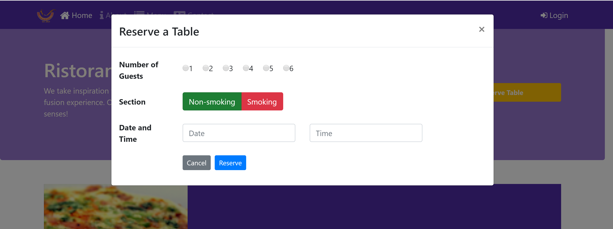

# Bootstrap - responsive design - a restaurant website

**Develop a responsive website using Bootstrap grid system, Bootstrap CSS and Bootstrap JavaScript Components.**

If you are also interested in Bootstrap like me, just don't miss this project. You can fork this project and I appreciate your star.
[Find more about algorithms, front-end and back-end frameworks and techniques, databases in my blog.](https://tongshi049.github.io/2019/06/18/angular/)

#

## Overview

- Develops a **responsive** website using **Bootstrap grid system**.
- Designs the styles of website using **Bootstrap CSS** components, including **navbar-\***, **breadcrumb**, **jumbotron**, **btn-\***, **form-\***, **table-\***, **card-\***, **img-thumbnail**, **media-\***, **badge-\***, **alert-\***, ...
- Designs font icons using icons from **Font Awesome** and **bootstrap-social**.
- Develops codes to control the **JS** components (tooltip, modal, carousel) using **data-\***. attributes that **Bootstrap's JS API** provides.
- Develops task automation using **NPM Scripts**.
- Automates formular tasks using **Task Runners** like **Grunt** and **Gulp**.

#

## Project Snapshot

1. **Project Conclustion**:
<div>
  
</div>
<br> 

2. The **Index Page**: 
<div>
  
</div>
<br>

3. The **Abountus Page**:
<div>
  
</div>
<br>

4. The **Contact Page**:
<div>
  
</div>
<br>

5. The **Modals**:
<div>
  
</div>
<br>

<div>
  
</div>
<br>

#

## Getting Started

- Clone the project and go to the project foloder
```
git clone https://github.com/tongshi049/bootstrap-responsive-website.git
cd conFusion
```
- Install dependencies in project folder
```
npm install
``` 
- Launch development server by typing npm script in cmd
```
npm start
```

#

## Project Structure

```
|- dist/                        compiled version
|- css/                         global styles
|- js/                          js code
|- index.html                   index page
|- abountus.html                about us page
|- contactus.html               contact us page
|- package.json                 npm packages 
|- Gruntfile.js                 tasks run by Grunt
|- gulpfile.js                  tasks run by Gulp
```

#

## Code Scaffolding

Tasks are mostly based on `npm scripts` defined in `package.json` file. You can also define your own ones here.

#

### Dependencies

- "bootstrap": "^4.0.0",
- "bootstrap-social": "^5.1.1",
- "font-awesome": "^4.7.0",
- "jquery": "^3.3.1",
- "node-sass": "^4.12.0",
- "popper.js": "^1.12.9"

#

### Libraries

- [Bootstrap](https://getbootstrap.com/).
- [NPM](https://www.npmjs.com/).
- [Grunt](https://gruntjs.com/).
- [Gulp](https://gulpjs.com/).
